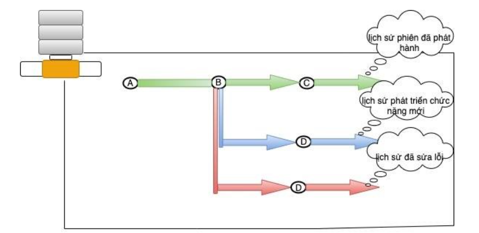
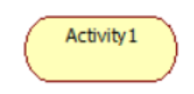

# Buổi 5: DEV thì không chỉ viết code

## 1, Version control là gì và tại sao cần sử dụng nó?
Version Control System (VCS) hay Software Control System (SCM) là một chương trình dùng để theo dõi và kiểm soát các file trong các dự án hay cũng có thể là một folder bình thường.

Mục đích của Version Control là có thể theo dõi những thay đổi đối với file hay có thể trả về những phiên bản trước đó. Ngoài ra, Version Control còn hỗ trợ làm việc nhóm trên cùng một dự án, trên cùng một file, trong cùng một khoảng thời gian mà không ảnh hưởng đến nhau.

**Tại sao sử dụng Version Control**

+ Theo dõi các thay đổi trên dự án, thời gian và người thay đổi
+ Thêm các message vào mỗi thay đổi để giải thích lý do cần thay đổi
+ Khôi phục lại phiên bản trước đó của project hay của từng file riêng biệt
+ Hỗ trợ tạo một phiên bản khác của dự án (branch), có thể sửa đổi trên các branch và tổng hợp lại khi hoàn thành sửa đổi, điều này giúp bảo vệ file ở branch chính.

**Distributed version control là gì?**

Các phiên bản trước đó VCS, bao gồm CVS, Subversion (SVN) và Perforce đều sử dụng một máy chủ trung tâm (centralized server) để lưu trữ dự án. Điều này dẫn đến khả năng mất mát dữ liệu do máy chủ bị lỗi.

Khác với các phiên bản kể trên, Git lưu trữ các thông tin lịch sử dự án trên cả máy khách (client) và máy chủ (server). Khi không có kết nối mạng, ta vẫn có thể chỉnh sửa, kiểm tra file; và đồng bộ với máy chủ khi có kết nối. Nếu server bị lỗi, thì ta vẫn có phiên bản lưu local và có thể thực hiện hầu hết các chức năng ngoại trừ chia sẻ file với nhiều thành viên cùng lúc.

## 2, Các thuật ngữ của Git

Git cung cấp các câu lệnh cho phép thực hiện các chức năng của một Distributed Version Control System. Dưới đây là những thuật ngữ, khái niệm và câu lệnh mà ta cần biết để có thể sử dụng Git một cách hiệu quả.

* **Working tree**: Tập hợp các thư mục và file chứa project.

* **Repository (repo)**: Nằm ở vị trí cao nhất của working tree, có thể coi nó là 1 dự án, chứa toàn bộ source code, là nơi sẽ ghi lại trạng thái của thư mục và file từ khi ta khởi tạo đến hiện tại. Nếu repository được lưu trên máy tính của bạn, nó được gọi là `local repository`, còn nếu nó được lưu ở trên các server chuyên cung cấp dịch vụ về git nó được gọi là `remote repository`.  
Hiện nay có một số Git server phổ biến như là Github, GitLab, Bitbucket,…

* **Branch**: Một repo có thể chứa 1 hoặc nhiều branch, mỗi branch có thể xem là một phiên bản của project. Các branch khi được khởi tạo sẽ chứa toàn bộ dữ liệu của branch trước đó, ta có thể thực hiện thay đổi trên branch này mà không làm ảnh hưởng trên branch trước đó *(dữ liệu trên các branch là độc lập)*, sau khi hoàn tất chỉnh sửa, ta có thể kết hợp các branch lại. Việc sử dụng branch cho phép chúng ta có thể thực hiện nhiều thay đổi cùng lúc mà không làm ảnh hưởng đến version đã được hoàn tất trước đó.

  
* **Commit**: Một repository có thể có rất nhiều commit, commit là những lần bạn chỉnh sửa và update phiên bản mới lên repository.
Mỗi commit sẽ đi kèm với các thông tin sau:
1. Thời gian thực hiện commit
2. Thông tin người thực hiện
3. Các thay đổi trên project
Mỗi commit sẽ được mã hóa bằng một mã hash


* **Merge**: gộp 2 branch lại với nhau, sau khi đã hoàn tất chỉnh sửa trên branch khác, ta cần tổng hợp về một branch gốc.
Câu lệnh:
```git
$ git merge <branch_name>  
$ git merge <branch-name> <merged-branch-name>
```

* **Pull**: là lệnh dùng để tải xuống từ một Remote Repository và đồng bộ với Local Repository.
Câu lệnh:
```git
$ git pull
$ git pull origin master
```

* **Push**: là lệnh dùng để đẩy các commit hoặc branch từ Local lên Remote Repository.  
Câu lệnh:
```git
1, Đồng bộ branch: $ git push -u origin <branch name>
2, Đẩy tất cả branch: $ git push --all
```
Nếu chưa tồn tại Remote Repos thì trước hết ta phải tạo và liên kết với Local Repos hiện tại.
```git
$ git remote add origin <Remote repos direct link>
```

* **Clone**: là lệnh sử dụng để sao chép (clone) một kho lưu trữ Git từ một địa chỉ khác về máy tính của bạn. Lệnh này thường được sử dụng khi bạn muốn bắt đầu làm việc trên một dự án mới hoặc khi bạn muốn sao chép một bản sao của một dự án đã tồn tại từ một kho lưu trữ Git khác. Git clone: khác với fork; nó là một bản remote local copy của một số kho lưu trữ. Khi bạn sao chép, bạn đang sao chép toàn bộ repo, bao gồm tất cả lịch sử và các nhánh.
Câu lệnh:
```git
$ git clone path-git
```

* **Fork**: là một bản copy của một repository. Việc fork một repository cho phép bạn dễ dàng chỉnh sửa, thay đổi source code mà không ảnh hưởng tới source gốc.

## 3, Khi nào cần Pull Request? Cách tạo Pull Request

Pull Request là một tính năng của hệ thống quản lý mã nguồn (source control system) như Git, GitHub, hay GitLab. Nó là một cách để người dùng có thể đề xuất thay đổi vào mã nguồn của một dự án đã được lưu trữ trên hệ thống quản lý mã nguồn đó.

Thực tế khi bạn làm việc trong team có nhiều người, mỗi một chức năng bạn hoàn thành code và cần được team review, bạn không thể gọi mọi người đến máy tính của bạn và ngồi đấy review từng dòng code cho bạn. Bạn cũng không thể gửi từng file source code cho người review để họ download về máy và review được - quá tốn thời gian và thật sự không chuyên nghiệp. Và tất nhiên khi khách hàng (đang ở một nơi nào đấy rất rất xa bạn) muốn tham gia review code của bạn thì chuyện này càng khó khăn hơn. Đó là lúc cần dùng đến Pull Request.

Khi một pull request được chấp nhận, các thay đổi được hợp nhất vào branch chính của dự án. Quá trình này có thể được tự động hóa bằng các công cụ tích hợp liên kết với hệ thống quản lý mã nguồn. Pull request là một cách linh hoạt và an toàn để đóng góp vào dự án và đảm bảo rằng các thay đổi mới không gây ra tác động tiêu cực đến mã nguồn hiện có.

**Tại sao cần Pull Request**
* Tăng tính minh bạch, thống nhất giữa các thành viên trong team
* Hạn chế lỗi, tăng chất lượng dự án

**Cách tạo Pull Request**
* Tạo một branch mới
* Thực hiện chỉnh sửa và commit
* Tạo Pull Request: đưa ra yêu cầu, thông báo đến các thành viên trong team xem xét lại sửa đổi
* Xem xét và thảo luận
* Merge vào branch chính: chấp nhận các thay đổi

## 4, UML là gì? Lí do cần vẽ UML
* Là ngôn ngữ đồ họa tiêu chuẩn, sử dụng cho nhiều lĩnh vực kỹ thuật trong đó có công nghệ phần mềm
* Là ngôn ngữ ký hiệu sử dụng trong lập trình hướng đối tượng.
* Biểu diễn, quy định cụ thể, xây dựng và tài liệu về hệ thống phần mềm.

**Lý do cần có UML**
* **Hiểu rõ yêu cầu**: UML giúp biểu diễn yêu cầu của khách hàng và những chức năng cần thực hiện trong hệ thống. Cung cấp một phương tiện để diễn đạt yêu cầu một cách rõ ràng và dễ hiểu.
* **Thiết kế hệ thống**: UML hỗ trợ việc thiết kế hệ thống bằng cách mô tả các lớp, đối tượng, mối quan hệ, và các phần tử khác của hệ thống. Cho phép nhóm phát triển hiểu cấu trúc và quan hệ giữa các thành phần của hệ thống.
* **Tạo mã nguồn**: UML có thể được sử dụng để sinh mã nguồn tự động hoặc hướng dẫn quá trình lập trình, đặc biệt là trong việc tạo ra các lớp và mối quan hệ giữa chúng.
* **Hiểu rõ quy trình làm việc**: UML hỗ trợ mô hình hóa quy trình làm việc thông qua các sơ đồ hoạt động và sơ đồ tuần tự, giúp hiểu rõ luồng công việc trong hệ thống.
* **Tài liệu hóa**: UML tạo ra tài liệu chi tiết và rõ ràng, giúp các thành viên trong nhóm phát triển và bảo trì hệ thống.
* **Giao tiếp**: UML cung cấp một ngôn ngữ chung để giao tiếp giữa các thành viên trong nhóm phát triển, giúp họ hiểu rõ ý tưởng và thiết kế của nhau.

## 5, Mô hình Class Diagram, Activity Diagram

### 5.1, Class Diagram
Mô tả cấu trúc hệ thống: mô tả các Class của hệ thống, thuộc tính của chúng và mối quan hệ giữa các Class.
**Mục đích:**
* Phân tích và thiết kế các view tĩnh của ứng dụng.
* Thế hiện sự thống nhất giữa các thành phân view tĩnh.
* Mô tả sự phản hồi của hệ thống.
* Cơ sở cho các sơ đồ thành phần và triển khai.

**Ví dụ**
Mô hình class diagram:


Code thực thi:
```java
import java.io.*;
 
class GFG {
    public static void main(String[] args)
    {
        dog d1 = new dog();
        d1.bark();
        d1.run();
        cat c1 = new cat();
        c1.meww();
    }
}
 
class Animal {
    public void run()
    {
        String name;
        String colour;
 
        System.out.println("animal is running");
    }
}
 
class dog extends Animal {
    public void bark()
    {
        System.out.println("wooh!wooh! dog is barking");
    }
    public void run()
    {
        System.out.println("dog is running");
    }
}
 
class cat extends Animal {
    public void meww()
    {
        System.out.println("meww! meww!");
    }
}
```

### 5.2, Activity Diagram

* Là sơ đồ quy trình công việc từng bước các hành động với sự hỗ trợ cho sự lựa chọn, lặp đi lặp lại và đồng thời.
* Thế hiện dòng chảy hành động được kiểm soát như thế nào.
* Được tạo từ các shape và kết nối bằng arrow. 
**Cách xây dựng Activity Diagram:**
* Bước 1: Xác định các nghiệp vụ cần mô tả Xem xét bản vẽ Use Case để xác định nghiệp vụ nào bạn cần mô tả. 
* Bước 2: Xác định trạng thái đầu tiên và trạng thái kết thúc Bước 3: Xác định các hoạt động tiếp theo Xuất phát từ điểm bắt đầu, phân tích để xác định các hoạt động tiếp theo cho đến khi gặp điểm kết thúc để hoàn tất bản vẽ này. Bạn có thể hỏi chuyên gia, học hệ thống tương tự, hỏi khách hàng để nắm rõ về qui trình của hệ thống.
  
**Các ký hiệu**

* Start:

* End:

* Activity:

* Branch:

* Fork:

* Join:
